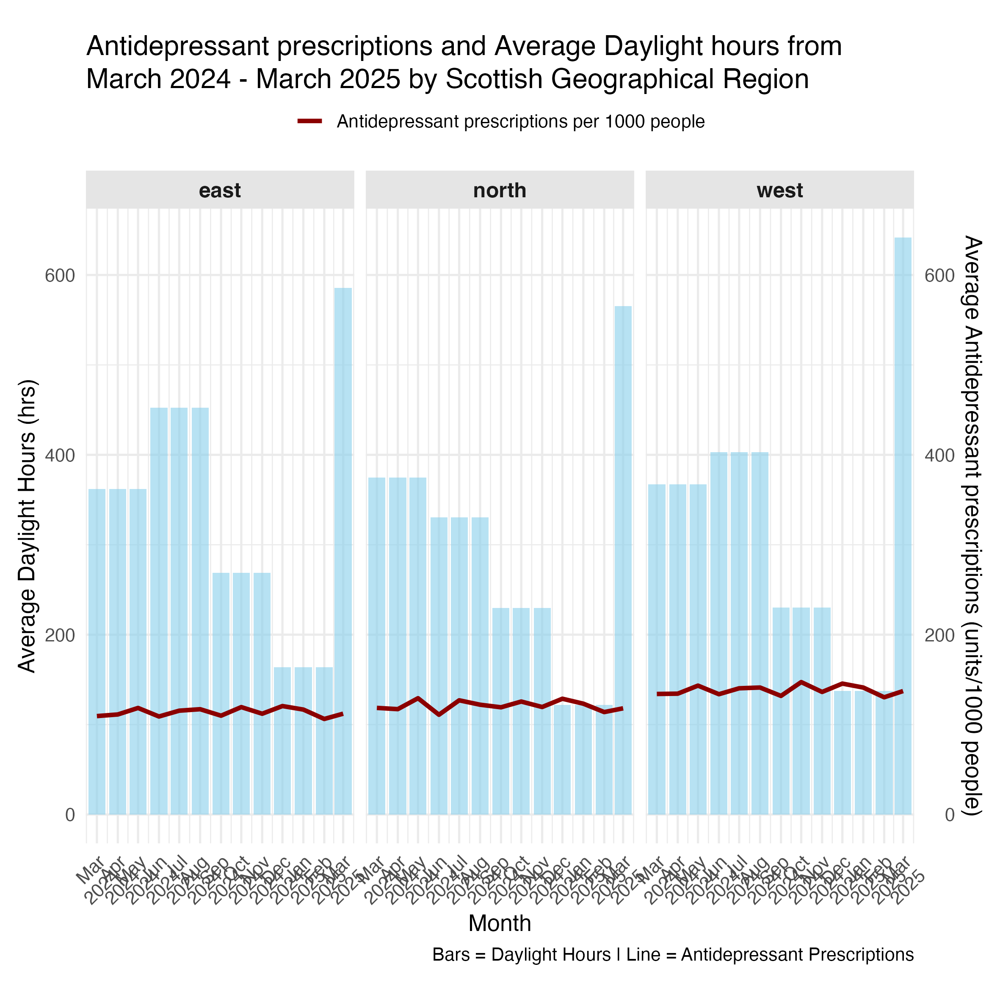

```{r setup, include=FALSE}
knitr::opts_chunk$set(echo = TRUE)
```

# Formative Assessment

## Research Question

The research question to be explored is:

> To what extent do seasonal variations relating to daylight hours affect antidepressant prescribing rates across Scottish NHS Health Boards?

## Data used

### Health Board Data

January to June 2024: <https://www.opendata.nhs.scot/dataset/84393984-14e9-4b0d-a797-b288db64d088/resource/f0df380b-3f9b-4536-bb87-569e189b727a/download/hb_pitc2024_01_06-1.csv>

July to December 2024: <https://www.opendata.nhs.scot/dataset/84393984-14e9-4b0d-a797-b288db64d088/resource/f3b9f2e2-66c0-4310-9b8e-734781d2ed0a/download/hb_pitc2024_07_12-1.csv>

January to June 2025: <https://www.opendata.nhs.scot/dataset/84393984-14e9-4b0d-a797-b288db64d088/resource/9de908b3-9c28-4cc3-aa32-72350a0579d1/download/hb_pitc2025_01_06.csv>

### Met Office Seasonal Data - Daylight hours

North Scotland: <https://www.metoffice.gov.uk/pub/data/weather/uk/climate/datasets/Sunshine/ranked/Scotland_N.txt>

East Scotland: <https://www.metoffice.gov.uk/pub/data/weather/uk/climate/datasets/Sunshine/ranked/Scotland_E.txt>

West Scotland: <https://www.metoffice.gov.uk/pub/data/weather/uk/climate/datasets/Sunshine/ranked/Scotland_W.txt>

### Scottish Index of Multiple Deprivation (SMID quintiles) Data

<https://www.opendata.nhs.scot/dataset/78d41fa9-1a62-4f7b-9edb-3e8522a93378/resource/acade396-8430-4b34-895a-b3e757fa346e/download/simd2020v2_22062020.csv>

## Next Steps

1.  I will do a general plot without faceted regional sub-plots to show the general trend of daylight hours and antidepressant prescriptions.

2.  I will also do a heat map of Scotland showing how NHS Health Boards differ in antidepressant prescription rates in each of the seasons.

3.  Finally, I'm also aiming to then do a plot using `ggplot()` and `geom_map()` to show the Scottish multiple index of deprivation (SMID) per Health Board and how daylight hours affects those.

## Graph


